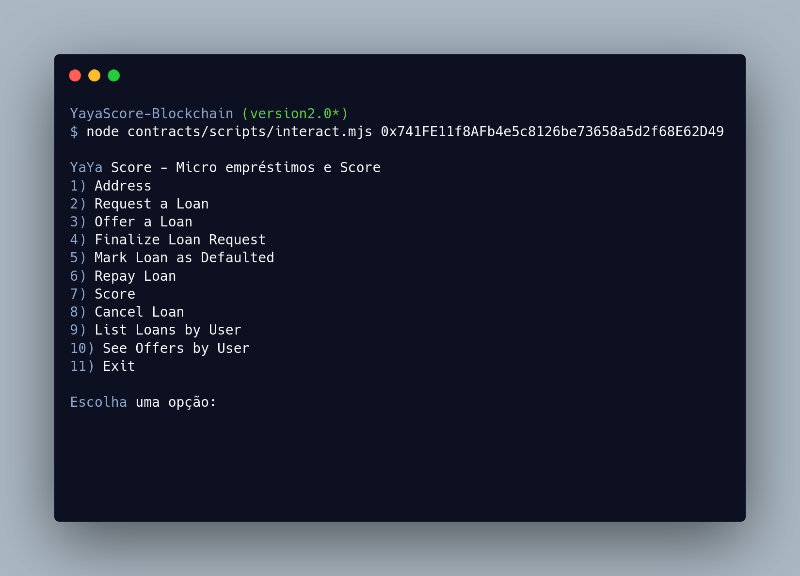

# Yaya Score - Guide 

## Pré-requisitos

Certifique-se de que todas as dependências necessárias foram instaladas.

## Passos para iniciar a rede de teste Ganache:

### 1. Abra o Ganache e crie uma nova rede de teste.

### 2. No terminal, navegue até a pasta raiz do projeto:
```bash
cd /path/to/YayaScore-Blockchain
```

### 3. Compile os contratos inteligentes usando o Truffle:
```bash
truffle compile
```

### 4. Migre os contratos para a rede de teste:
```bash
truffle migrate
```

O comando truffle migrate mostra como resultado algumas informações sobre o contrato e a rede de testes, uma dessas informações é o endereço do contrato. Guarde essa informação pois será necessária para executar o script de interação.

### 5. Execute o script de interação _interact.mjs_:
```bash
node contracts/scripts/interact.mjs <contract-address>
```

## Exemplo:

<p align="center">
    
</p>

<p align="center">
    
</p>
